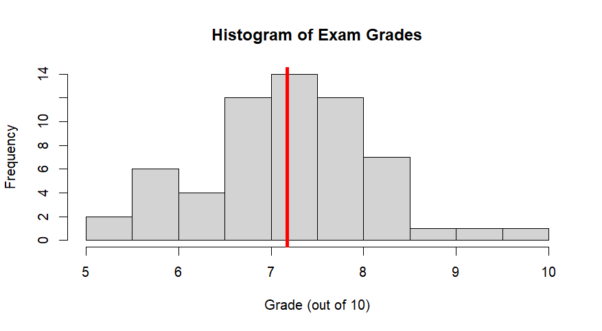

# PIPS2023A3
Assignment 3 PIPS 2023

## remind_me()

This function returns the names of famous people that were born on the day you introduce. For instance, you could run this function every day and see who was born that day of the year.

### Example

``` r
remind_me(month = 05, day = 06) # Freud's birthday

  [1] "Blair, Tony"        "Brodeur, Martin"    "Carter, Rubin"     
  [4] "Clooney, George"    "Dorfman, Ariel"     "Freud, Sigmund"    
  [7] "Levin, Gerald M"    "Mays, Willie"       "Nussbaum, Martha C"
  [10] "Pawson, John"       "Shelby, Richard C"  "Turrell, James"    
  [13] "Welles, Orson"

# Who was born on today's date?
remind_me(month = as.POSIXlt(Sys.time())$mon + 1, day = as.POSIXlt(Sys.time())$mday)
```
 


## cheat()

The cheat() function provides the correct answer to some of the exercises in assignment 3.1 So far, it only has 4 exercises as part of it, but it could be expanded to contain all of assignment 3.1.


### Example

``` r
cheat(1)
```


